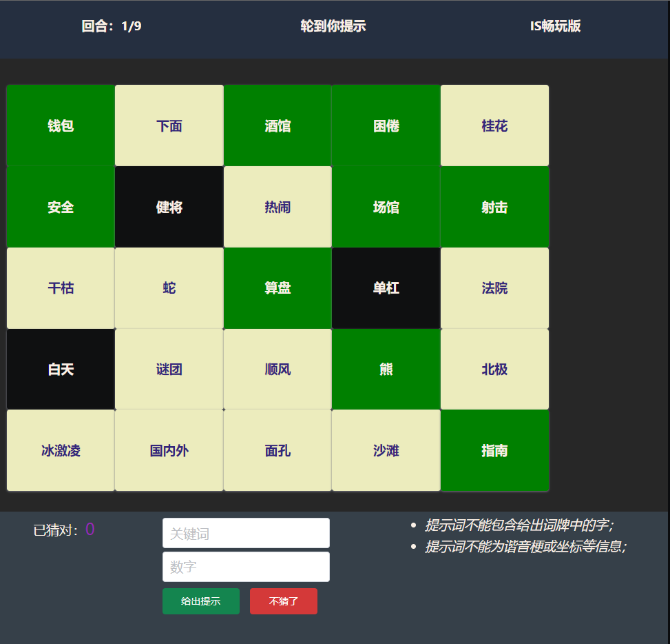

## BoardGames in Lab project

- Server side: python + flask
- UI: chota.css

## How to play

1. Make sure you have a partner and both of you are in the same LAN.

2. One of you run the server:
```
python index.py
```

3. Both vist "server_ip:6969".
4. Choose the game and then "link & ready".

### Display




